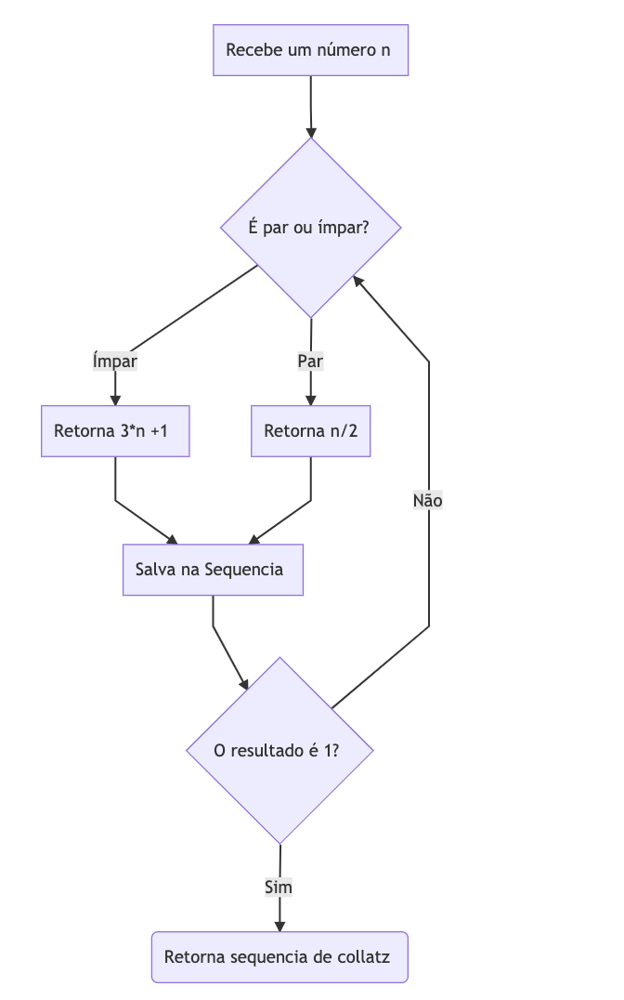
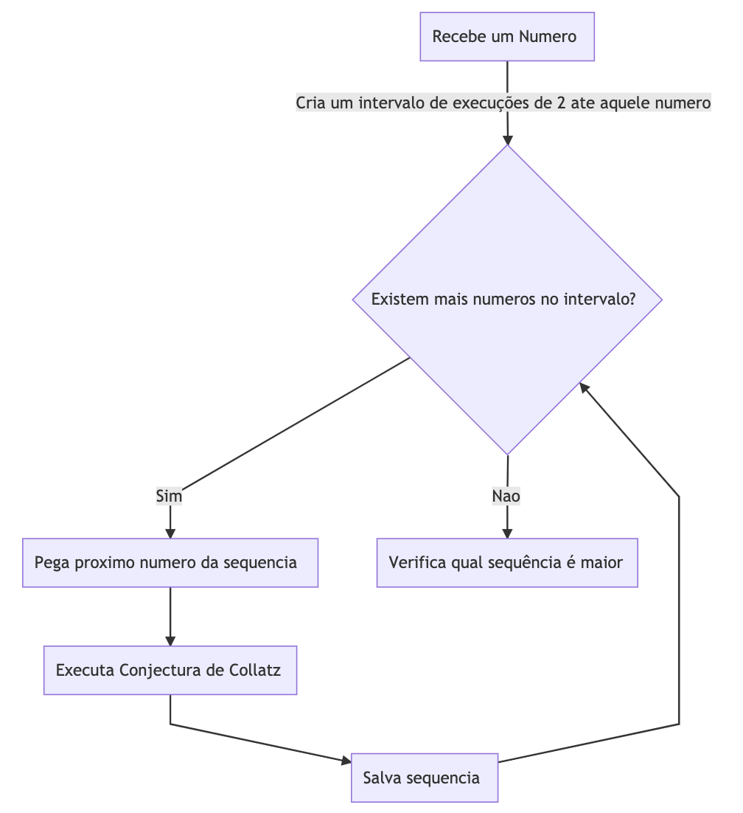

## Conjectura de Collatz

- *"A matemática não está pronta para esse tipo de problema. Absolutamente Impossível" (Paul Erdős)*
- *"Como o granizo nas nuvens antes de cair, os números saltam de um lugar ao outro antes de chegar ao 4, 2, 1." (BBC - Por que um problema simples é um dos buracos negros da matemática)*
### O que é
- É um algortimo matemático que acreditam que ao conseguirmos solucionar a lógica por trás dos seus intervalos, vamos nos abrir para novas e importantes técnicas dentro da teoria dos números

### Como funciona?

- Dado um número inteiro positivo, aplicamos nele uma função F(x) tal que se o número em questão for um número ímpar, retornamos ele mesmo, multiplicado por três e somamos um (3*x + 1), porém se o mesmo for um número par, retornamos ele mesmo dividido por dois (x /2).
- Após isso anotamos esse resultado em algum lugar.
- Continuamos esse processo até que o resultado dê um.
- Pegamos todos os resultados anotados e temos agora nossa sequencia.

### Efeito Granizo
- O algoritmo apresenta saltos de um número para o outro, até então jamais explicados.

### **Problema:** Encontrando as maiores sequências
- Dado um número X dentro dos números reais, gostaríamos de saber qual o número no intervalo de 2 até o número X escolhido, que produz a maior sequência aplicando a Conjectura de Collatz.
- Exemplo: Passado o número 7, aplicamos o algoritmo para o 2, para o 3, para o 4, para o 5, para o 6 e para o 7. Dentro dessas seis execuções do algoritmo, verificamos qual deles retornou a sequência com mais números.

### Algoritmo Sequencial x Paralelo
 - Decidimos fazer os testes coma  Conjectura de Collatz com dois algoritmos distintos: um sequencial e um pararelo, derivado do sequencial.
 - A idéia é conseguir dividir partes da execução entre diversos nós e verificar se houve eficiência

#### As Branches:
- Separamos em duas Branches: Uma com o Algoritmo Sequencial e a outra com o Algoritmo Paralelo. Desta forma fica fácil transitar entre ambos e ter um controle maior do código

#### A biblioteca:
 - Decidimos utilizar a Biblioteca Mpi.h, para medir o tempo da execução dos algoritmos
 - E para orchestrar a execução paralela do algoritmo entre os múltiplos nós do Cluster

### Algoritmo Sequêncial
- Dividimos entre duas funções: a collatz_conjecture e a get_maximum_sequence.
- A primeira apenas aplica o algoritmo para apenas um número
- A segunda aplica o algoritmo para todos os números entre 2 e o número escolhido e descobre qual deles produz a maior sequencia de collatz.

### Algoritmo Paralelo - Dividindo em Clusters
- Tendo um Cluster Homogêneo, vamos dividir a execução de diferentes execuções do algoritmo, tal que no final das execuções tenhamos uma entrega de resultados finais, mais rápida
 - Utilizamos o MPI_Comm_rank para definir qual o nó do Cluster executaríamos cada parte do algoritmo
 - O nó zero ficou como Master e aguarda a execução dos outros nós para só assim então, verificar qual a maior sequência e indicar quanto tempo demorou a execução
 - A barreira ficou restituida pela execução de três instruções MPI_Recv, uma para cada nó Slave.

### Conclusão
- Tivemos sucesso ao executar o algortimo no cluster, tendo eficiência de N-1 vezes o tamanho do Cluster.
- O algoritmo executal muito rápido, porém na primeira versão testamos ele recursivo e os resultados não foram muito agradáveis: Tivemos um aumento considerável no tempo de execução e na quantidade de memória gasta. Conseguimos executar cerca de 400 mil números além do que conseguimos executar no algoritmo recursivo

### Próximos Passos
- Informamos no algorítmo de forma estática a quantidade de nós. O próximo passo seria informarmos de forma dinâmica a quantidade de nós
- Também seria legal utilizarmos uma abordagem para tratar erros, e mudanças no número de nós
- Por fim acredito que seria interessante fazermos um balanceador de carga, que conseguisse distinguir quanto cada nó aguentaria executar, mas principalmente, saber quanto poderíamos aproveitar do nó zero, além do que ele já executa, porquê estamos perdendo um nó ao utilizar ele como master e apenas como sincronizador.

###End
